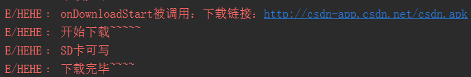
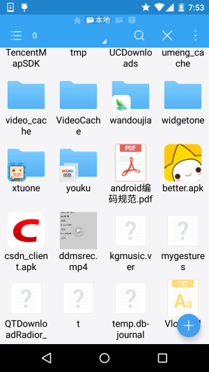

## 7.5.4 WebView文件下载

### 

## 本节引言

> 本节给大家介绍的是WebView下载文件的知识点，当我们在使用普通浏览器的时候，比如UC， 当我们点击到一个可供下载链接的时候，就会进行下载，WebView作为一个浏览器般的组件， 当然也是支持下载，我们可以自己来写下载的流程，设置下载后的文件放哪，以什么文件名保存，当然也可以调用其它内置的浏览器来进行下载，比如Chrome，UC等等！ 下面给大家演示下用法！

------

## 1.调用其它浏览器下载文件：

> 这个很简单，我们只需为WebView设置setDownloadListener，然后重写DownloadListener的 onDownloadStart，然后在里面写个Intent，然后startActivity对应的Activity即可！

**关键代码如下**：

```
wView.setDownloadListener(new DownloadListener(){
@Override
public void onDownloadStart(String url, String userAgent, String contentDisposition, 
    String mimetype, long contentLength) {
        Log.e("HEHE","开始下载");
        Uri uri = Uri.parse(url);
        Intent intent = new Intent(Intent.ACTION_VIEW, uri);
        startActivity(intent);
    }
});
```

如果你手机内存在多个浏览器的话，会打开一个对话框供你选择其中一个浏览器进行下载~

------

## 2.自己写线程下载文件

> 当然，你可能不想把下载文件放到默认路径下，或者想自己定义文件名等等，你都可以自己来写 一个线程来下载文件，实现示例代码如下：

**核心代码**：

我们自己另外写一个下载的线程类：

**DownLoadThread.java**

```
/**
 * Created by Jay on 2015/9/14 0014.
 */
public class DownLoadThread implements Runnable {

    private String dlUrl;

    public DownLoadThread(String dlUrl) {
        this.dlUrl = dlUrl;
    }

    @Override
    public void run() {
        Log.e("HEHE", "开始下载~~~~~");
        InputStream in = null;
        FileOutputStream fout = null;
        try {
            URL httpUrl = new URL(dlUrl);
            HttpURLConnection conn = (HttpURLConnection) httpUrl.openConnection();
            conn.setDoInput(true);
            conn.setDoOutput(true);
            in = conn.getInputStream();
            File downloadFile, sdFile;
            if (Environment.getExternalStorageState().equals(Environment.MEDIA_MOUNTED)) {
                Log.e("HEHE","SD卡可写");
                downloadFile = Environment.getExternalStorageDirectory();
                sdFile = new File(downloadFile, "csdn_client.apk");
                fout = new FileOutputStream(sdFile);
            }else{
                Log.e("HEHE","SD卡不存在或者不可读写");
            }
            byte[] buffer = new byte[1024];
            int len;
            while ((len = in.read(buffer)) != -1) {
                fout.write(buffer, 0, len);
            }
        } catch (Exception e) {
            e.printStackTrace();
        } finally {
            if (in != null) {
                try {
                    in.close();
                } catch (IOException e) {
                    e.printStackTrace();
                }
            }
            if (fout != null) {
                try {
                    fout.close();
                } catch (IOException e) {
                    e.printStackTrace();
                }
            }
        }
        Log.e("HEHE", "下载完毕~~~~");
    }
}
```

然后**MainActivity.java**中创建并启动该线程：

```
wView.setDownloadListener(new DownloadListener(){
    @Override
    public void onDownloadStart(String url, String userAgent, String contentDisposition, 
    String mimetype, long contentLength) {
            Log.e("HEHE","onDownloadStart被调用：下载链接：" + url);
            new Thread(new DownLoadThread(url)).start();
    }
});
```

**运行结果**：



我们打开SD卡可以看到，下载好的文件已经安安静静地躺在SD卡里了：



**注意事项**：

好的，另外，别忘了写SD卡的读写权限以及Internet访问网络的权限：

```
<uses-permission android:name="android.permission.INTERNET"/>
<!-- 在SDCard中创建与删除文件权限 -->
<uses-permission android:name="android.permission.MOUNT_UNMOUNT_FILESYSTEMS"/>
<!-- 往SDCard写入数据权限 -->
<uses-permission android:name="android.permission.WRITE_EXTERNAL_STORAGE"/>
```

还有，**in = conn.getInputStream()**;要写在conn设置完所有东西的后面！！切记，不然什么都读不了！

------

## 本节小结：

> 本节非常简单，代码就不贴出了，其实就是setDownloadListener这个玩意，自己重写下 onDownloadStart方法来处理下载过程而已~，本节就到这里，谢谢~

