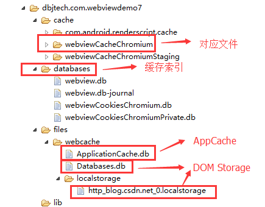
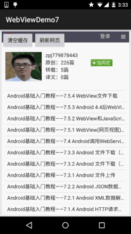

## 7.5.5 WebView缓存问题

### 

## 本节引言：

> 现在很多门户类信息网站，比如虎嗅，ifanr，钛媒体等等的APP，简单点说是信息阅读类的APP，很多都是直接嵌套一个WebView用来显示相关资讯的，这可能就涉及到了WebView的缓存了！
>
> 所谓的页面缓存就是指：保存加载一个网页时所需的HTML，JS，CSS等页面相关的数据以及其他资源，当没网的时候或者网络状态较差的时候，加载本地保存好的相关数据！而实现这个缓存的方式有两种，一种是后台写一个下载的Service，将文章相关的数据按自己的需求下载到数据库或者保存到相应文件夹中，然后下次加载对应URL前先判断是否存在本地缓存，如果存在优先加载本地缓存，不存在则执行联网请求，同时缓存相关资源，典型的如旧版本的36Kr，在进去后会先离线文章，然后再显示！
>
> 当然，本节要讲解的不是这种自己写逻辑的方式，而是通过WebView本身自带的缓存功能来缓存页面，这种方式使用起来非常简单，我们只需为WebView设置开启相关功能，以及设置数据库的缓存路径即可完成缓存！具体的实现我们下面一一道来~

------

## 1.缓存的分类：

> 首先要说的一点是缓存的分类，我们缓存的数据分为：**页面缓存和数据缓存**
>
> - **页面缓存**：加载一个网页时的html、JS、CSS等页面或者资源数据，这些缓存资源是由于浏览器的行为而产生，开发者只能通过配置HTTP响应头影响浏览器的行为才能间接地影响到这些缓存数据。 而**缓存的索引**放在：/data/data/<包名>/databases **对应的文件**放在：/data/data/package_name/cache/webviewCacheChromunm下
> - **数据缓存**：分为AppCache和DOM Storage两种 我们开发者可以自行控制的就是这些缓存资源，
> - **AppCache**：我们能够有选择的缓冲web浏览器中所有的东西，从页面、图片到脚本、css等等。 尤其在涉及到应用于网站的多个页面上的CSS和JavaScript文件的时候非常有用。其大小目前通常是5M。 在Android上需要手动开启（setAppCacheEnabled），并设置路径（setAppCachePath）和容量 （setAppCacheMaxSize），而Android中使用**ApplicationCache.db**来保存AppCache数据！
> - **DOM Storage**：存储一些简单的用key/value对即可解决的数据，根据作用范围的不同，有Session Storage和Local Storage两种，分别用于会话级别的存储（页面关闭即消失）和本地化存储（除非主动删除，否则数据永远不会过期）在Android中可以手动开启DOM Storage（setDomStorageEnabled）， 设置存储路径（setDatabasePath）Android中Webkit会为DOMStorage产生两个文件（my_path/localstorage/http_blog.csdn.net_0.localstorage和my_path/Databases.db）

好吧，看完上面，是不是想说一句，卧槽，什么鬼，好复杂的样子.当然，不要去背，知道有这些东西就好了，实际开发用到再慢慢考究，而且我们一般只关心如何为WebView设置缓存以及如何删除缓存！ 我们可以看下我们下面写的demo运行后的文件结构，打开DDMS的File Explorer：



嘿嘿，一目了然是吧~，对了另外还要说下几种缓存的模式：

> - **LOAD_CACHE_ONLY**: 不使用网络，只读取本地缓存数据
> - **LOAD_DEFAULT**: 根据cache-control决定是否从网络上取数据。
> - **LOAD_CACHE_NORMAL**: API level 17中已经废弃, 从API level 11开始作用同LOAD_DEFAULT模式
> - **LOAD_NO_CACHE**: 不使用缓存，只从网络获取数据.
> - **LOAD_CACHE_ELSE_NETWORK**，只要本地有，无论是否过期，或者no-cache，都使用缓存中的数据。

**总结**：根据以上两种模式，建议缓存策略为，判断是否有网络，有的话，使用LOAD_DEFAULT， 无网络时，使用LOAD_CACHE_ELSE_NETWORK。

接下来堆码时间！

------

## 2.为WebView开启缓存功能

下面我们就来为WebView开启缓存功能，先来看下实现的效果图：

**运行效果图**：



**流程解析**： 1.进入页面后默认加载url，然后随便点击一个链接跳到第二个页面，退出APP 2.关闭wifi以及移动网络，然后重新进入，发现无网络的情况下，页面还是加载了， 打开第一个链接也可以加载，打开其他链接就发现找不到网页！ 3.点击清除缓存，把应用关闭，重新进入，发现页面已经打不开！

接下来是代码实现：**MainActivity.java**:

```
public class MainActivity extends AppCompatActivity {

    private WebView wView;
    private Button btn_clear_cache;
    private Button btn_refresh;
    private static final String APP_CACHE_DIRNAME = "/webcache"; // web缓存目录
    private static final String URL = "http://blog.csdn.net/coder_pig";

    @Override
    protected void onCreate(Bundle savedInstanceState) {
        super.onCreate(savedInstanceState);
        setContentView(R.layout.activity_main);
        wView = (WebView) findViewById(R.id.wView);
        btn_clear_cache = (Button) findViewById(R.id.btn_clear_cache);
        btn_refresh = (Button) findViewById(R.id.btn_refresh);
        wView.loadUrl(URL);
        wView.setWebViewClient(new WebViewClient() {
            //设置在webView点击打开的新网页在当前界面显示,而不跳转到新的浏览器中
            @Override
            public boolean shouldOverrideUrlLoading(WebView view, String url) {
                view.loadUrl(url);
                return true;
            }
        });
        WebSettings settings = wView.getSettings();
        settings.setJavaScriptEnabled(true);
        //设置缓存模式
        settings.setCacheMode(WebSettings.LOAD_CACHE_ELSE_NETWORK);
        // 开启DOM storage API 功能
        settings.setDomStorageEnabled(true);
        // 开启database storage API功能
        settings.setDatabaseEnabled(true);
        String cacheDirPath = getFilesDir().getAbsolutePath() + APP_CACHE_DIRNAME;
        Log.i("cachePath", cacheDirPath);
        // 设置数据库缓存路径
        settings.setAppCachePath(cacheDirPath);
        settings.setAppCacheEnabled(true);
        Log.i("databasepath", settings.getDatabasePath());

        btn_clear_cache.setOnClickListener(new View.OnClickListener() {
            @Override
            public void onClick(View v) {
                wView.clearCache(true);
            }
        });

        btn_refresh.setOnClickListener(new View.OnClickListener() {
            @Override
            public void onClick(View v) {
                wView.reload();
            }
        });
    }

    //重写回退按钮的点击事件
    @Override
    public void onBackPressed() {
        if(wView.canGoBack()){
            wView.goBack();
        }else{
            super.onBackPressed();
        }
    }
}
```

代码很简单，我们做的仅仅是开启缓存的功能，以及设置缓存模式以及缓存的数据的路径而已！

------

## 3.删除WebView的缓存数据

> 上面的示例，我们通过调用WebView的clearCache(true)方法，已经实现了对缓存的删除！ 除了这种方法外，还有下述方法：
>
> - **setting.setCacheMode(WebSettings.LOAD_NO_CACHE)**;
> - **deleteDatabase("WebView.db");和deleteDatabase("WebViewCache.db");**
> - **webView.clearHistory()**;
> - **webView.clearFormData()**;
> - **getCacheDir().delete()**;
> - 手动写delete方法，循环迭代删除缓存文件夹！

当然，前面也说，我们能这直接操作的只是数据部分，而页面缓存是由于浏览器的行为而产生，我们只能通过配置HTTP响应头影响浏览器的行为才能间接地影响到 这些缓存数据。所以上述的方法仅仅是删除的数据部分的缓存！

------

## 4.示例代码下载：

**WebViewDemo7.zip**：[下载 WebViewDemo7.zip](https://www.runoob.com/try/download/WebViewDemo7.zip)

------

## 5.本节小结：

> 好的，本节关于WebView缓存问题就到这里，这里只是写了如何为WebView开启缓存， 以及删除缓存，以后遇到再慢慢考究，这里有个映像先~嗯，就说这么多~谢谢 
>
> 对了，差点忘了贴下本节的参考链接：
>
> [Android webView 缓存 Cache + HTML5离线功能 解决](http://87426628.blog.163.com/blog/static/6069361820139183417725/)
>
> [Android记录25-WebView实现离线缓存阅读](http://blog.csdn.net/wwj_748/article/details/44835865)
>
> [Android 清除WebView缓存](http://whitelaning.github.io/2015/05/07/Clear_the_WebView_Cache.html)