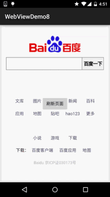
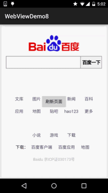

## 7.5.6 WebView处理网页返回的错误码信息

### 

## 本节引言：

> 嘿嘿，假如你们公司是做HTML5端的移动APP的，就是通过WebView来显示网页的，假如你访问的网页不存在，或者其他错误，报404，401，403，30X等错误的状态码，如果直接弹出WebView默认的错误提示页面，可能显得不那么友好，我们可以重写WebViewClient的onReceivedError()方法来实现我们想要的效果，一般的做法有两种，一种是：我们自己在assets目录下创建一个用于显示错误信息的 HTML页面，当发生错误，即onReceivedError()被调用的时候我们调用webView的loadUrl跳到我们 的错误页面，比如:wView.loadUrl("file:///android_asset/error.html");!又或者我们另外写一个布局或者直接一个大大的图片，平时设置为不可见，当页面错误时，让该布局或者图片可见！ 下面我们来写个简单的示例！

------

## 1.页面错误，加载自定义网页：

**运行效果图**：



**关键代码**：

```
wView.setWebViewClient(new WebViewClient() {
//设置在webView点击打开的新网页在当前界面显示,而不跳转到新的浏览器中
@Override
public boolean shouldOverrideUrlLoading(WebView view, String url) {
    view.loadUrl(url);
    return true;
}

@Override
public void onReceivedError(WebView view, int errorCode, String description,
    String failingUrl) {
        super.onReceivedError(view, errorCode, description, failingUrl);
        wView.loadUrl("file:///android_asset/error.html");
    }
});
```

------

## 2.页面错误，显示相应的View

**运行效果图**：



**实现代码：**

```
public class MainActivity extends AppCompatActivity implements View.OnClickListener{

    private WebView wView;
    private ImageView img_error_back;
    private Button btn_refresh;

    @Override
    protected void onCreate(Bundle savedInstanceState) {
        super.onCreate(savedInstanceState);
        setContentView(R.layout.activity_main);
        wView = (WebView) findViewById(R.id.wView);
        img_error_back = (ImageView) findViewById(R.id.img_error_back);
        btn_refresh = (Button) findViewById(R.id.btn_refresh);
        wView.loadUrl("http://www.baidu.com");
        wView.setWebViewClient(new WebViewClient() {
            //设置在webView点击打开的新网页在当前界面显示,而不跳转到新的浏览器中
            @Override
            public boolean shouldOverrideUrlLoading(WebView view, String url) {
                view.loadUrl(url);
                return true;
            }

            @Override
            public void onReceivedError(WebView view, int errorCode, String description, String failingUrl) {
                super.onReceivedError(view, errorCode, description, failingUrl);
                wView.setVisibility(View.GONE);
                img_error_back.setVisibility(View.VISIBLE);
            }
        });
        btn_refresh.setOnClickListener(this);
    }

    @Override
    public void onClick(View v) {
        wView.loadUrl("http://www.baidu.com");
        img_error_back.setVisibility(View.GONE);
        wView.setVisibility(View.VISIBLE);
    }
}
```

------

## 3.示例代码下载：

**WebViewDemo8.zip**：[下载 WebViewDemo8.zip](https://www.runoob.com/try/download/WebViewDemo8.zip)

------

## 本节小结：

> 嗯，很简单的一个小节，哈哈，超简单是吧，另外我们还可以根据不同的errorCode来设置不同的 页面~这里就自己扩展咯，关于WebView的基本学习就到这里吧，下一节开始我们将迎来网络编程的 中一个难点：Socket网络编程，当然如果学过，自然学起来简单，没学过也没关系，小猪带你撸 Socket~敬请期待~