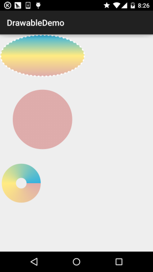

## 8.1.1 Android中的13种Drawable小结 Part 1

## 本节引言：

> 从本节开始我们来学习Android中绘图与动画中的一些基础知识，为我们进阶部分的自定义打下基础！而第一节我们来扣下Android中的Drawable！Android中给我们提供了多达13种的 Drawable，本节我们就来一个个撸一遍！
>
> 

------

## Drawable资源使用注意事项

> - Drawable分为两种： 一种是我们**普通的图片资源**，在Android Studio中我们一般放到res/mipmap目录下， 和以前的Eclipse不一样哦！另外我们如果把工程切换成Android项目模式，我们直接 往mipmap目录下丢图片即可，AS会自动分hdpi，xhdpi...！ 另一种是我们编写的**XML形式的Drawable资源**，我们一般把他们放到res/drawable目录 下，比如最常见的按钮点击背景切换的Selctor！
>
> - 在XML我们直接通过@mipmap或者@drawable设置Drawable即可 比如: android:background = "@mipmap/iv_icon_zhu" / "@drawable/btn_back_selctor" 而在Java代码中我们可以通过Resource的getDrawable(R.mipmap.xxx)可以获得drawable资源
>
>   如果是为某个控件设置背景，比如ImageView，我们可以直接调用控件.getDrawale()同样 可以获得drawable对象！
>
> - Android中drawable中的资源名称有约束，必须是：**[a-z0-9_.]**（即：只能是字母数字及*和.）， 而且不能以数字开头，否则编译会报错： Invalid file name: must contain only [a-z0-9*.]！ 小写啊！！！！小写！！！小写！——重要事情说三遍~

好的，要注意的地方大概就这些，下面我们来对Android中给我们提供的13种Drawable进行学习！

------

## 1.ColorDrawable

> 最简单的一种Drawable，当我们将ColorDrawable绘制到Canvas(画布)上的时候, 会使用一种固定的颜色来填充Paint,然后在画布上绘制出一片单色区域!

### 1).Java中定义ColorDrawable:

```
ColorDrawable drawable = new ColorDrawable(0xffff2200);  
txtShow.setBackground(drawable);  
```

### 2).在xml中定义ColorDrawable:

```
<?xml version="1.0" encoding="utf-8"?>  
<color  
    xmlns:android="http://schemas.android.com/apk/res/android"  
    android:color="#FF0000"/>  
```

当然上面这些用法,其实用得不多,更多的时候我们是在res/values目录下创建一个color.xml 文件,然后把要用到的颜色值写到里面,需要的时候通过@color获得相应的值，比如：

### 3).建立一个color.xml文件

比如：

```
<?xml version="1.0" encoding="utf-8"?>  
<resources>  
    <color name="material_grey_100">#fff5f5f5</color>
    <color name="material_grey_300">#ffe0e0e0</color>
    <color name="material_grey_50">#fffafafa</color>
    <color name="material_grey_600">#ff757575</color>
    <color name="material_grey_800">#ff424242</color>
    <color name="material_grey_850">#ff303030</color>
    <color name="material_grey_900">#ff212121</color>
</resources>
```

然后如果是在xml文件中话我们可以通过@color/xxx获得对应的color值 如果是在Java中:

```
int mycolor = getResources().getColor(R.color.mycolor);    
btn.setBackgroundColor(mycolor);  
```

ps:另外有一点要注意,如果我们在Java中直接定义颜色值的话,要加上0x,而且不能把透明度漏掉:

```
int mycolor = 0xff123456;    
btn.setBackgroundColor(mycolor); 
```

### 4).使用系统定义好的color:

比如:BLACK(黑色),BLUE(蓝色),CYAN(青色),GRAY(灰色),GREEN(绿色),RED(红色),WRITE(白色),YELLOW(黄色)! 用法： **btn.setBackgroundColor(Color.BLUE);** 也可以获得系统颜色再设置：

```
int getcolor = Resources.getSystem().getColor(android.R.color.holo_green_light);  
btn.setBackgroundColor(getcolor);  
```

xml中使用:**android:background="@android:color/black"**

### 5).利用静态方法argb来设置颜色:

> Android使用一个int类型的数据表示颜色值,通常是十六进制,即0x开头， 颜色值的定义是由透明度alpha和RGB(红绿蓝)三原色来定义的,以"#"开始,后面依次为:
> **透明度-红-绿-蓝**;eg:#RGB #ARGB #RRGGBB #AARRGGBB
> 每个要素都由一个字节(8 bit)来表示,所以取值范围为0~255,在xml中设置颜色可以忽略透明度, 但是如果你是在Java代码中的话就需要明确指出透明度的值了,省略的话表示完全透明,这个时候 就没有效果了哦~比如:0xFF0000虽然表示红色,但是如果直接这样写,什么的没有,而应该这样写: 0xFFFF0000,记Java代码设置颜色值,需要在前面添加上透明度~ 示例:(参数依次为:透明度,红色值,绿色值,蓝色值) **txtShow.setBackgroundColor(Color.argb(0xff, 0x00, 0x00, 0x00));**

------

## 2.NiewPatchDrawable

> 就是.9图咯，在前面我们[1.6 .9(九妹)图片怎么玩](http://www.runoob.com/w3cnote/android-tutorial-9-image.html)已经详细的给大家讲解了一下如何制作.9图片了！Android FrameWork在显示点九图时使用了高效的图形优化算法, 我们不需要特殊的处理，就可以实现图片拉伸的自适应~ 另外在使用AS的时候要注意以下几点：
>
> - 1.点9图不能放在mipmap目录下，而需要放在drawable目录下！
> - 2.AS中的.9图，必须要有黑线，不然编译都不会通过，今早我的阿君表哥在群里说他司的美工给了他一个没有黑线的.9图，说使用某软件制作出来的，然后在Eclipse上是可以用的，没错是没黑线的.9，卧槽，然而我换到AS上，直接编译就不通过了！ 感觉是AS识别.9图的其中标准是需要有黑店或者黑线！另外表哥给出的一个去掉黑线的： [9patch(.9)怎么去掉自己画上的黑点/黑线](https://www.runoob.com/w3cnote/9patch-9-remove-black-line.html) 具体我没试，有兴趣可以自己试试，但是黑线真的那么碍眼么...我没强迫症不觉得！ 另外还有一点就是解压别人apk，拿.9素材的时候发现并没有黑线，同样也会报错！ 想要拿出有黑线的.9素材的话，需要反编译apk而非直接解压！！！反编译前面也 介绍过了，这里就不详述了！

接着介绍两个没什么卵用的东东：

**xml定义NinePatchDrawable**:

```
<!--pic9.xml-->  
<!--参数依次为:引用的.9图片,是否对位图进行抖动处理-->  
<?xml version="1.0" encoding="utf-8"?>  
<nine-patch  
    xmlns:android="http://schemas.android.com/apk/res/android"  
    android:src="@drawable/dule_pic"  
    android:dither="true"/>  
```

**使用Bitmap包装.9图片**:

```
<!--pic9.xml-->  
<!--参数依次为:引用的.9图片,是否对位图进行抖动处理-->  
<?xml version="1.0" encoding="utf-8"?>  
<bitmap  
    xmlns:android="http://schemas.android.com/apk/res/android"  
    android:src="@drawable/dule_pic"  
    android:dither="true"/>
```

------

## 3.ShapeDrawable

> 形状的Drawable咯,定义基本的几何图形,如(矩形,圆形,线条等),根元素是<shape../> 节点比较多，相关的节点如下：
>
> - ① <**shape**>:
> - ~ **visible**:设置是否可见
> - ~ **shape**:形状,可选:rectangle(矩形,包括正方形),oval(椭圆,包括圆),line(线段),ring(环形)
> - ~ **innerRadiusRatio**:当shape为ring才有效,表示环内半径所占半径的比率,如果设置了innerRadius, 他会被忽略
> - ~ **innerRadius**:当shape为ring才有效,表示环的内半径的尺寸
> - ~ **thicknessRatio**:当shape为ring才有效,表环厚度占半径的比率
> - ~ **thickness**:当shape为ring才有效,表示环的厚度,即外半径与内半径的差
> - ~ **useLevel**:当shape为ring才有效,表示是否允许根据level来显示环的一部分
> - ②<**size**>:
> - ~ **width**:图形形状宽度
> - ~ **height**:图形形状高度
> - ③<**gradient**>：后面GradientDrawable再讲~
> - ④<**solid**>
> - ~ **color**:背景填充色,设置solid后会覆盖gradient设置的所有效果!!!!!!
> - ⑤<**stroke**>
> - ~ **width**:边框的宽度
> - ~ **color**:边框的颜色
> - ~ **dashWidth**:边框虚线段的长度
> - ~ **dashGap**:边框的虚线段的间距
> - ⑥<**conner**>
> - ~ **radius**:圆角半径,适用于上下左右四个角
> - ~ **topLeftRadius**,**topRightRadius**,**BottomLeftRadius**,**tBottomRightRadius**: 依次是左上,右上,左下,右下的圆角值,按自己需要设置!
> - ⑦<**padding**>
> - left,top,right,bottm:依次是左上右下方向上的边距!

**使用示例**： [2.3.1 TextView(文本框)详解](http://www.runoob.com/w3cnote/android-tutorial-textview.html)


------

## 4.GradientDrawable

> 一个具有渐变区域的Drawable，可以实现线性渐变,发散渐变和平铺渐变效果 核心节点：<**gradient**/>，有如下可选属性：
>
> - **startColor**:渐变的起始颜色
> - **centerColor**:渐变的中间颜色
> - **endColor**:渐变的结束颜色
> - **type**:渐变类型,可选(**linear**,**radial**,**sweep**), **线性渐变**(可设置渐变角度),发散渐变(中间向四周发散),平铺渐变
> - **centerX**:渐变中间亚瑟的x坐标,取值范围为:0~1
> - **centerY**:渐变中间颜色的Y坐标,取值范围为:0~1
> - **angle**:只有linear类型的渐变才有效,表示渐变角度,必须为45的倍数哦
> - **gradientRadius**:只有radial和sweep类型的渐变才有效,radial必须设置,表示渐变效果的半径
> - **useLevel**:判断是否根据level绘制渐变效果

**代码示例**：(三种渐变效果的演示)：

**运行效果图**：



先在drawable下创建三个渐变xml文件：

**(线性渐变)gradient_linear.xml**:

```
<?xml version="1.0" encoding="utf-8"?>
<shape
    xmlns:android="http://schemas.android.com/apk/res/android"
    android:shape="oval" >
    <gradient
        android:angle="90"
        android:centerColor="#FFEB82"
        android:endColor="#35B2DE"
        android:startColor="#DEACAB" />

    <stroke
        android:dashGap="5dip"
        android:dashWidth="4dip"
        android:width="3dip"
        android:color="#fff" />
</shape>
```

**(发散渐变)gradient_radial.xml**:

```
<?xml version="1.0" encoding="utf-8"?>
<shape xmlns:android="http://schemas.android.com/apk/res/android"
    android:innerRadius="0dip"
    android:shape="ring"
    android:thickness="70dip"
    android:useLevel="false" >

    <gradient
        android:centerColor="#FFEB82"
        android:endColor="#35B2DE"
        android:gradientRadius="70"
        android:startColor="#DEACAB"
        android:type="radial"
        android:useLevel="false" />

</shape> 
```

**(平铺渐变)gradient_sweep.xml**:

```
<?xml version="1.0" encoding="utf-8"?>
<shape xmlns:android="http://schemas.android.com/apk/res/android"
    android:innerRadiusRatio="8"
    android:shape="ring"
    android:thicknessRatio="3"
    android:useLevel="false" >

    <gradient
        android:centerColor="#FFEB82"
        android:endColor="#35B2DE"
        android:startColor="#DEACAB"
        android:type="sweep"
        android:useLevel="false" />

</shape> 
```

调用三个drawable的**activity_main.xml**:

```
<LinearLayout xmlns:android="http://schemas.android.com/apk/res/android"
    xmlns:tools="http://schemas.android.com/tools"
    android:layout_width="match_parent"
    android:layout_height="match_parent"
    android:orientation="vertical">

    <TextView
        android:id="@+id/txtShow1"
        android:layout_width="200dp"
        android:layout_height="100dp"
        android:background="@drawable/gradient_linear" />

    <TextView
        android:id="@+id/txtShow2"
        android:layout_width="200dp"
        android:layout_height="200dp"
        android:background="@drawable/gradient_radial" />

    <TextView
        android:id="@+id/txtShow3"
        android:layout_width="100dp"
        android:layout_height="100dp"
        android:background="@drawable/gradient_sweep" />

</LinearLayout>  
```

好的，就是那么简单~当然，如果想绘制更加复杂的图形的话,只用xml文件不远远不足的, 更复杂的效果则需要通过Java代码来完成,下面演示的是摘自网上的一个源码:

运行效果图：

**实现代码**：

**MainActivity.java**：

```
public class MainActivity extends AppCompatActivity {
    @Override
    protected void onCreate(Bundle savedInstanceState) {
        super.onCreate(savedInstanceState);
        setContentView(new SampleView(this));
    }

    private static class SampleView extends View {
        private ShapeDrawable[] mDrawables;

        private static Shader makeSweep() {
            return new SweepGradient(150, 25,
                    new int[] { 0xFFFF0000, 0xFF00FF00, 0xFF0000FF, 0xFFFF0000 },
                    null);
        }

        private static Shader makeLinear() {
            return new LinearGradient(0, 0, 50, 50,
                    new int[] { 0xFFFF0000, 0xFF00FF00, 0xFF0000FF },
                    null, Shader.TileMode.MIRROR);
        }

        private static Shader makeTiling() {
            int[] pixels = new int[] { 0xFFFF0000, 0xFF00FF00, 0xFF0000FF, 0};
            Bitmap bm = Bitmap.createBitmap(pixels, 2, 2,
                    Bitmap.Config.ARGB_8888);

            return new BitmapShader(bm, Shader.TileMode.REPEAT,
                    Shader.TileMode.REPEAT);
        }

        private static class MyShapeDrawable extends ShapeDrawable {
            private Paint mStrokePaint = new Paint(Paint.ANTI_ALIAS_FLAG);

            public MyShapeDrawable(Shape s) {
                super(s);
                mStrokePaint.setStyle(Paint.Style.STROKE);
            }

            public Paint getStrokePaint() {
                return mStrokePaint;
            }

            @Override protected void onDraw(Shape s, Canvas c, Paint p) {
                s.draw(c, p);
                s.draw(c, mStrokePaint);
            }
        }

        public SampleView(Context context) {
            super(context);
            setFocusable(true);

            float[] outerR = new float[] { 12, 12, 12, 12, 0, 0, 0, 0 };
            RectF inset = new RectF(6, 6, 6, 6);
            float[] innerR = new float[] { 12, 12, 0, 0, 12, 12, 0, 0 };

            Path path = new Path();
            path.moveTo(50, 0);
            path.lineTo(0, 50);
            path.lineTo(50, 100);
            path.lineTo(100, 50);
            path.close();

            mDrawables = new ShapeDrawable[7];
            mDrawables[0] = new ShapeDrawable(new RectShape());
            mDrawables[1] = new ShapeDrawable(new OvalShape());
            mDrawables[2] = new ShapeDrawable(new RoundRectShape(outerR, null,
                    null));
            mDrawables[3] = new ShapeDrawable(new RoundRectShape(outerR, inset,
                    null));
            mDrawables[4] = new ShapeDrawable(new RoundRectShape(outerR, inset,
                    innerR));
            mDrawables[5] = new ShapeDrawable(new PathShape(path, 100, 100));
            mDrawables[6] = new MyShapeDrawable(new ArcShape(45, -270));

            mDrawables[0].getPaint().setColor(0xFFFF0000);
            mDrawables[1].getPaint().setColor(0xFF00FF00);
            mDrawables[2].getPaint().setColor(0xFF0000FF);
            mDrawables[3].getPaint().setShader(makeSweep());
            mDrawables[4].getPaint().setShader(makeLinear());
            mDrawables[5].getPaint().setShader(makeTiling());
            mDrawables[6].getPaint().setColor(0x88FF8844);

            PathEffect pe = new DiscretePathEffect(10, 4);
            PathEffect pe2 = new CornerPathEffect(4);
            mDrawables[3].getPaint().setPathEffect(
                    new ComposePathEffect(pe2, pe));

            MyShapeDrawable msd = (MyShapeDrawable)mDrawables[6];
            msd.getStrokePaint().setStrokeWidth(4);
        }

        @Override protected void onDraw(Canvas canvas) {

            int x = 10;
            int y = 10;
            int width = 400;
            int height = 100;

            for (Drawable dr : mDrawables) {
                dr.setBounds(x, y, x + width, y + height);
                dr.draw(canvas);
                y += height + 5;
            }
        }
    }
}
```

> 代码使用了ShapeDrawable和PathEffect,前者是对普通图形的包装;包括: ArcShape,OvalShape,PathShape,RectShape,RoundRectShape!
> 而PathEffect则是路径特效,包括:CornerPathEffect,DashPathEffect和DiscretePathEffect 可以制作复杂的图形边框...
> 关于这个GradoemtDrawable渐变就讲到这里,如果你对最后面这个玩意有兴趣的话,可以到: [appium/android-apidemos](https://github.com/appium/android-apidemos/tree/master/src/io/appium/android/apis/graphics)

------

## 本节小结：

>  好的，本节就先学习ColorDrawable，NiewPatchDrawable，ShapeDrawable，GradientDrawable
> 四个Drawable先，当然这些都是炒冷饭，以前已经写过了，不过为了教程的完整性，还是决定 在写一遍~另外，在写完基础教程后，以前写过的一些blog会删掉！