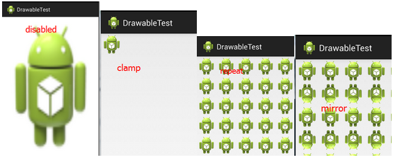
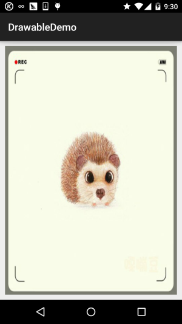
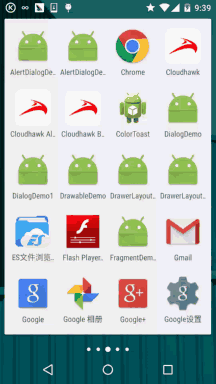
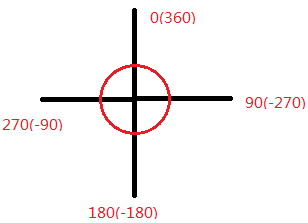
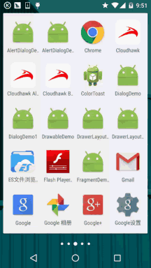
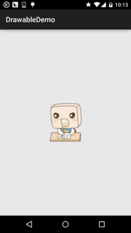

## 8.1.2 Android中的13种Drawable小结 Part 2

### 

## 本节引言：

> 本节我们继续来学习Android中的Drawable资源，上一节我们学习了：
> **ColorDrawable**；
> **NinePatchDrawable**；
> **ShapeDrawable**；
> **GradientDrawable**！
> 这四个Drawable~ 而本节我们继续来学习接下来的五个Drawable，他们分别是：
> **BitmapDrawable**；
> **InsertDrawable**；
> **ClipDrawable**；
> **RotateDrawable**；
> **AnimationDrawable**!
> 还是贴下13种Drawable的导图：
>
> 
>
> 好的，开始本节内容~

------

## 1.BitmapDrawable

> 对Bitmap的一种封装, 可以设置它包装的bitmap在BitmapDrawable区域中的绘制方式,有: 平铺填充, 拉伸填或保持图片原始大小! 以<**bitmap**>为根节点! 可选属性如下：
>
> - **src**:图片资源~
> - **antialias**:是否支持抗锯齿
> - **filter**:是否支持位图过滤,支持的话可以是图批判显示时比较光滑
> - **dither**:是否对位图进行抖动处理
> - **gravity**:若位图比容器小,可以设置位图在容器中的相对位置
> - **tileMode**:指定图片平铺填充容器的模式,设置这个的话, gravity属性会被忽略, 有以下可选值: **disabled**(整个图案拉伸平铺), **clamp**(原图大小), **repeat**(平铺), **mirror**(镜像平铺)
>
> 对应的效果图：
>
> 

**①XML定义BitmapDrawable**:

```
<?xml version="1.0" encoding="utf-8"?>  
<bitmap xmlns:android="http://schemas.android.com/apk/res/android"  
    android:dither="true"  
    android:src="@drawable/ic_launcher"  
    android:tileMode="mirror" />
```

**②实现相同效果的Java代码**:

```
BitmapDrawable bitDrawable = new BitmapDrawable(bitmap);  
bitDrawable.setDither(true);  
bitDrawable.setTileModeXY(TileMode.MIRROR,TileMode.MIRROR);  
```

------

## 2.InsetDrawable

> 表示把一个Drawable嵌入到另外一个Drawable的内部，并且在内部留一些间距, 类似与Drawable的padding属性,但**padding**表示的是**Drawable的内容与Drawable本身的边距**! 而**InsetDrawable**表示的是**两个Drawable与容器之间的边距**,当控件需要的**背景比实际的边框 小的时候**,比较适合使用InsetDrawable,比如使用这个可以解决我们自定义Dialog与屏幕之间 的一个间距问题,相信做过的朋友都知道,即使我们设置了layout_margin的话也是没用的,这个 时候就可以用到这个InsetDrawable了!只需为InsetDrawable设置一个insetXxx设置不同 方向的边距,然后为设置为Dialog的背景即可！

相关属性如下：

> - 1.**drawable**:引用的Drawable,如果为空,必须有一个Drawable类型的子节点!
> - 2.**visible**:设置Drawable是否额空间
> - 3.**insetLeft**,**insetRight**,**insetTop**,**insetBottm**:设置左右上下的边距

**①XML中使用**:

```
<?xml version="1.0" encoding="utf-8"?>  
<inset xmlns:android="http://schemas.android.com/apk/res/android"  
    android:drawable="@drawable/test1"  
    android:insetBottom="10dp"  
    android:insetLeft="10dp"  
    android:insetRight="10dp"  
    android:insetTop="10dp" /> 
```

**在Java代码中使用**：

```
InsetDrawable insetDrawable = new InsetDrawable(getResources()  
        .getDrawable(R.drawable.test1), 10, 10, 10, 10); 
```

**使用效果图**：



------

## 3.ClipDrawable

> Clip可以译为剪的意思,我们可以把ClipDrawable理解为从位图上剪下一个部分; Android中的进度条就是使用ClipDrawable来实现的,他根据设置level的值来决定剪切区域的大小,根节点是<**clip**>

**相关属性如下**：

> - **clipOrietntion**:设置剪切的方向,可以设置水平和竖直2个方向
> - **gravity**:从那个位置开始裁剪
> - **drawable**:引用的drawable资源,为空的话需要有一个Drawable类型的子节点 ps:这个Drawable类型的子节点:就是在<clip里>加上这样的语句: 这样...

**使用示例**：

核心：通过代码修改ClipDrawable的level的值！Level的值是0~10000！

**运行效果图**：



**代码实现**：

**①定义一个ClipDrawable的资源xml**:

```
<?xml version="1.0" encoding="utf-8"?>
<clip xmlns:android="http://schemas.android.com/apk/res/android"
    android:clipOrientation="horizontal"
    android:drawable="@mipmap/ic_bg_meizi"
    android:gravity="left" /> 
```

**②在activity_main主布局文件中设置一个ImageView,将src设置为clipDrawable!** **记住是src哦,如果你写成了blackground的话可是会报空指针的哦!!!!**

```
<LinearLayout xmlns:android="http://schemas.android.com/apk/res/android"
    xmlns:tools="http://schemas.android.com/tools"
    android:layout_width="match_parent"
    android:layout_height="match_parent"
    android:orientation="vertical">

    <ImageView
        android:id="@+id/img_show"
        android:layout_width="match_parent"
        android:layout_height="match_parent"
        android:src="@drawable/clip_bg" />

</LinearLayout>  
```

**③MainActivity.java通过setLevel设置截取区域大小**:

```
public class MainActivity extends AppCompatActivity {

    private ImageView img_show;
    private ClipDrawable cd;
    private Handler handler = new Handler() {
        @Override
        public void handleMessage(Message msg) {
            if (msg.what == 0x123) {
                cd.setLevel(cd.getLevel() + 500);
            }
        }
    };

    @Override
    protected void onCreate(Bundle savedInstanceState) {
        super.onCreate(savedInstanceState);
        setContentView(R.layout.activity_main);
        img_show = (ImageView) findViewById(R.id.img_show);
        // 核心实现代码
        cd = (ClipDrawable) img_show.getDrawable();
        final Timer timer = new Timer();
        timer.schedule(new TimerTask() {
            @Override
            public void run() {
                handler.sendEmptyMessage(0x123);
                if (cd.getLevel() >= 10000) {
                    timer.cancel();
                }
            }
        }, 0, 300);
    }
}
```

好的，有点意思，妹子图别问我拿，百度上一堆哈~

------

## 4.RotateDrawable

> 用来对Drawable进行旋转,也是通过setLevel来控制旋转的,最大值也是:10000

**相关属性如下**：

> - **fromDegrees**:起始的角度,,对应最低的level值,默认为0
> - **toDegrees**:结束角度,对应最高的level值,默认360
> - **pivotX**:设置参照点的x坐标,取值为0~1,默认是50%,即0.5
> - **pivotY**:设置参照点的Y坐标,取值为0~1,默认是50%,即0.5 ps:如果出现旋转图片显示不完全的话可以修改上述两个值解决!
> - **drawable**:设置位图资源
> - **visible**:设置drawable是否可见!

**角度图如下**：



**使用示例**：

**运行效果图**：



**代码实现**：

在第三点的clipDrawable上做一点点修改即可!

**①定义一个rotateDrawable资源文件**:

```
<?xml version="1.0" encoding="utf-8"?>
<rotate xmlns:android="http://schemas.android.com/apk/res/android"
    android:drawable="@mipmap/ic_launcher"
    android:fromDegrees="-180"
    android:pivotX="50%"
    android:pivotY="50%" />  
```

**②activity_main.xml中修改下src指向上述drawable即可,MainActivity只需要把ClipDrawable** **改成rotateDrawable即可!**

```
public class MainActivity extends AppCompatActivity {

    private ImageView img_show;
    private RotateDrawable cd;
    private Handler handler = new Handler() {
        @Override
        public void handleMessage(Message msg) {
            if (msg.what == 0x123) {
                if (cd.getLevel() >= 10000)
                    Toast.makeText(MainActivity.this, "转完了~",
                            Toast.LENGTH_LONG).show();
                cd.setLevel(cd.getLevel() + 400);
            }
        }
    };

    @Override
    protected void onCreate(Bundle savedInstanceState) {
        super.onCreate(savedInstanceState);
        setContentView(R.layout.activity_main);
        img_show = (ImageView) findViewById(R.id.img_show);
        // 核心实现代码
        cd = (RotateDrawable) img_show.getDrawable();
        final Timer timer = new Timer();
        timer.schedule(new TimerTask() {
            @Override
            public void run() {
                handler.sendEmptyMessage(0x123);
                if (cd.getLevel() >= 10000) {
                    timer.cancel();
                }
            }
        }, 0, 100);
    }
}
```

------

## 5.AnimationDrawable

> 本节最后一个Drawable，AnimationDrawable是用来实现Android中帧动画的,就是把一系列的 Drawable，按照一定得顺序一帧帧地播放；Android中动画比较丰富,有传统补间动画,平移, 缩放等等效果,但是这里我们仅仅介绍这个AnimationDrawable实现帧动画,关于alpha,scale, translate,rotate等,后续在动画章节再进行详细的介绍~
>
> 我们这里使用<**animation-list**>作为根节点

**相关属性方法**:

> **oneshot**:设置是否循环播放,false为循环播放!!! **duration**:帧间隔时间,通常我们会设置为300毫秒 我们获得AniamtionDrawable实例后，需要调用它的start()方法播放动画，另外要注意 在OnCreate()方法中调用的话,是没有任何效果的,因为View还没完成初始化,我们可以 用简单的handler来延迟播放动画!当然还有其他的方法,可见下述链接: [Android AnimationDrawable运行的几种方式](https://www.runoob.com/w3cnote/android-animationdrawable.html) 使用AnimationDrawable来实现帧动画真的是非常方便的~

**使用示例**：

**运行效果图**：



**代码实现**：

①**先定义一个AnimationDrawable的xml资源文件**:

```
<?xml version="1.0" encoding="utf-8"?>
<animation-list xmlns:android="http://schemas.android.com/apk/res/android"
    android:oneshot="false">

    <item
        android:drawable="@mipmap/ic_pull_to_refresh_loading01"
        android:duration="100" />

    <item
        android:drawable="@mipmap/ic_pull_to_refresh_loading02"
        android:duration="100" />
    <item
        android:drawable="@mipmap/ic_pull_to_refresh_loading03"
        android:duration="100" />
    <item
        android:drawable="@mipmap/ic_pull_to_refresh_loading04"
        android:duration="100" />
    <item
        android:drawable="@mipmap/ic_pull_to_refresh_loading05"
        android:duration="100" />
    <item
        android:drawable="@mipmap/ic_pull_to_refresh_loading06"
        android:duration="100" />

</animation-list> 
```

**②activity_main.xml设置下src,然后MainActivity中**:

```
public class MainActivity extends AppCompatActivity {

    private ImageView img_show;
    private AnimationDrawable ad;

    @Override
    protected void onCreate(Bundle savedInstanceState) {
        super.onCreate(savedInstanceState);
        setContentView(R.layout.activity_main);
        img_show = (ImageView) findViewById(R.id.img_show);
        // 核心实现代码
        ad = (AnimationDrawable) img_show.getDrawable();
        Handler handler = new Handler();
        handler.postDelayed(new Runnable() {
            @Override
            public void run() {
                ad.start();
            }
        }, 300);
    }
}
```

嘿嘿，超简单有木有，以后在一些需要用到帧动画的地方，直接上**AnimationDrawable**， 当然，只适合于不需要进行控制的帧动画，比如上面这个就是超表下拉刷新时候的进度条素材 做成的一个简单帧动画！根据自己的需求自行拓展~

------

## 本节小结：

>  本节又介绍了另外的五个Drawable，很有趣是吧，还不快快将他们应用到你的实际开发当中~ 嘻嘻，就说这么多，谢谢!另外刚刚有读者私信我说以前的文章别删行不行，嗯，这里说下 只删除一些重复的，比如和这个雷同的那几节~当然我也会备份！删除的文章都会备份的~ 所以放心！