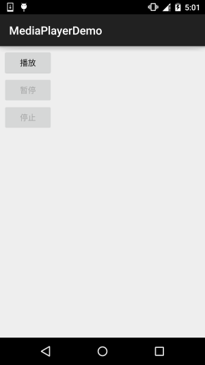
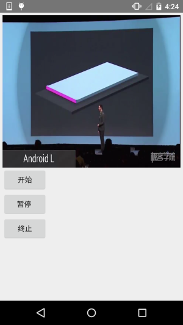

## 9.2 MediaPlayer播放音频与视频


## 本节引言：

> 本节带来的是Android多媒体中的——MediaPlayer，我们可以通过这个API来播放音频和视频，该类是Androd多媒体框架中的一个重要组件，通过该类，我们可以以最小的步骤来获取，解码和播放音视频。它支持三种不同的媒体来源：
>
> - 本地资源
> - 内部的URI，比如你可以通过ContentResolver来获取
> - 外部URL(流) 对于Android所支持的的媒体格式列表
>
> 对于Android支持的媒体格式列表，可见：[Supported Media Formats](http://androiddoc.qiniudn.com/guide/appendix/media-formats.html) 文档
>
> 本节我们就来用MediaPlayer来写个简单的播放音视频的例子！
>
> 官方API文档：[MediaPlayer](http://androiddoc.qiniudn.com/reference/android/media/MediaPlayer.html)

------

## 1.相关方法详解

------

### 1）获得MediaPlayer实例：

可以**直接new**或者调用**create**方法创建：

```
MediaPlayer mp = new MediaPlayer();
MediaPlayer mp = MediaPlayer.create(this, R.raw.test);  //无需再调用setDataSource
```

另外create还有这样的形式： **create(Context context, Uri uri, SurfaceHolder holder)** 通过Uri和指定 SurfaceHolder 【抽象类】 创建一个多媒体播放器

------

### 2）设置播放文件：

```
//①raw下的资源：
MediaPlayer.create(this, R.raw.test);

//②本地文件路径：
mp.setDataSource("/sdcard/test.mp3");

//③网络URL文件：
mp.setDataSource("http://www.xxx.com/music/test.mp3");
```

> 另外setDataSource()方法有多个，里面有这样一个类型的参数：FileDescriptor，在使用这个 API的时候，需要把文件放到res文件夹平级的assets文件夹里，然后使用下述代码设置DataSource：

```
AssetFileDescriptor fileDescriptor = getAssets().openFd("rain.mp3");
m_mediaPlayer.setDataSource(fileDescriptor.getFileDescriptor(), fileDescriptor.getStartOffset(), fileDescriptor.getLength());
```

------

### 3）其他方法

> - **getCurrentPosition**( )：得到当前的播放位置
> - **getDuration**() ：得到文件的时间
> - **getVideoHeight**() ：得到视频高度
> - **getVideoWidth**() ：得到视频宽度
> - **isLooping**()：是否循环播放
> - **isPlaying**()：是否正在播放
> - **pause**()：暂停
> - **prepare**()：准备(同步)
> - **prepareAsync**()：准备(异步)
> - **release()**：释放MediaPlayer对象
> - **reset**()：重置MediaPlayer对象
> - **seekTo(int msec)**：指定播放的位置（以毫秒为单位的时间）
> - **setAudioStreamType(int streamtype)**：指定流媒体的类型
> - **setDisplay(SurfaceHolder sh)**：设置用SurfaceHolder来显示多媒体
> - **setLooping(boolean looping)**：设置是否循环播放
> - **setOnBufferingUpdateListener(MediaPlayer.OnBufferingUpdateListener listener)**： 网络流媒体的缓冲监听
> - **setOnCompletionListener(MediaPlayer.OnCompletionListener listener)**： 网络流媒体播放结束监听
> - **setOnErrorListener(MediaPlayer.OnErrorListener listener)**： 设置错误信息监听
> - **setOnVideoSizeChangedListener(MediaPlayer.OnVideoSizeChangedListener listener)**： 视频尺寸监听
> - **setScreenOnWhilePlaying(boolean screenOn)**：设置是否使用SurfaceHolder显示
> - **setVolume(float leftVolume, float rightVolume)**：设置音量
> - **start**()：开始播放
> - **stop**()：停止播放

------

## 2.使用代码示例

### **示例一**：使用MediaPlayer播放音频：

**运行效果图**：



**关键代码**：

```
public class MainActivity extends AppCompatActivity implements View.OnClickListener{

    private Button btn_play;
    private Button btn_pause;
    private Button btn_stop;
    private MediaPlayer mPlayer = null;
    private boolean isRelease = true;   //判断是否MediaPlayer是否释放的标志

    @Override
    protected void onCreate(Bundle savedInstanceState) {
        super.onCreate(savedInstanceState);
        setContentView(R.layout.activity_main);
        bindViews();
    }

    private void bindViews() {
        btn_play = (Button) findViewById(R.id.btn_play);
        btn_pause = (Button) findViewById(R.id.btn_pause);
        btn_stop = (Button) findViewById(R.id.btn_stop);

        btn_play.setOnClickListener(this);
        btn_pause.setOnClickListener(this);
        btn_stop.setOnClickListener(this);
    }

    @Override
    public void onClick(View v) {
        switch (v.getId()){
            case R.id.btn_play:
                if(isRelease){
                    mPlayer = MediaPlayer.create(this,R.raw.fly);
                    isRelease = false;
                }
                mPlayer.start();   //开始播放
                btn_play.setEnabled(false);
                btn_pause.setEnabled(true);
                btn_stop.setEnabled(true);
                break;
            case R.id.btn_pause:
                mPlayer.pause();     //停止播放
                btn_play.setEnabled(true);
                btn_pause.setEnabled(false);
                btn_stop.setEnabled(false);
                break;
            case R.id.btn_stop:
                mPlayer.reset();     //重置MediaPlayer
                mPlayer.release();   //释放MediaPlayer
                isRelease = true;
                btn_play.setEnabled(true);
                btn_pause.setEnabled(false);
                btn_stop.setEnabled(false);
                break;
        }
    }
}
```

注意事项：

> 播放的是res/raw目录下的音频文件，创建MediaPlayer调用的是create方法，第一次启动播放前 不需要再调用prepare()，如果是使用构造方法构造的话，则需要调用一次prepare()方法！ 另外贴下官方文档中，从其他两种途径播放音频的示例代码:

**本地Uri**：

```
Uri myUri = ....; // initialize Uri here
MediaPlayer mediaPlayer = new MediaPlayer();
mediaPlayer.setAudioStreamType(AudioManager.STREAM_MUSIC);
mediaPlayer.setDataSource(getApplicationContext(), myUri);
mediaPlayer.prepare();
mediaPlayer.start();
```

**外部URL**：

```
String url = "http://........"; // your URL here
MediaPlayer mediaPlayer = new MediaPlayer();
mediaPlayer.setAudioStreamType(AudioManager.STREAM_MUSIC);
mediaPlayer.setDataSource(url);
mediaPlayer.prepare(); // might take long! (for buffering, etc)
mediaPlayer.start();
```

> **Note**：假如你通过一个URL以流的形式播放在线音频文件，该文件必须可以进行 渐进式下载

------

### **示例二**：使用MediaPlayer播放视频

MediaPlayer主要用于播放音频，没有提供图像输出界面，所以我们需要借助其他的组件来显示MediaPlayer播放的图像输出，我们可以使用**SurfaceView** 来显示，下面我们使用SurfaceView来写个视频播放的例子：

**运行效果图**：



**实现代码**：

布局文件：**activity_main.xml**

```
<LinearLayout xmlns:android="http://schemas.android.com/apk/res/android"
    android:layout_width="match_parent"
    android:layout_height="match_parent"
    android:orientation="vertical"
    android:padding="5dp">

    <SurfaceView
        android:id="@+id/sfv_show"
        android:layout_width="match_parent"
        android:layout_height="300dp" />

    <Button
        android:id="@+id/btn_start"
        android:layout_width="wrap_content"
        android:layout_height="wrap_content"
        android:text="开始" />

    <Button
        android:id="@+id/btn_pause"
        android:layout_width="wrap_content"
        android:layout_height="wrap_content"
        android:text="暂停 " />

    <Button
        android:id="@+id/btn_stop"
        android:layout_width="wrap_content"
        android:layout_height="wrap_content"
        android:text="终止" />
    
</LinearLayout>
```

**MainActivity.java**：

```
public class MainActivity extends AppCompatActivity implements View.OnClickListener, SurfaceHolder.Callback {

    private MediaPlayer mPlayer = null;
    private SurfaceView sfv_show;
    private SurfaceHolder surfaceHolder;
    private Button btn_start;
    private Button btn_pause;
    private Button btn_stop;

    @Override
    protected void onCreate(Bundle savedInstanceState) {
        super.onCreate(savedInstanceState);
        setContentView(R.layout.activity_main);
        bindViews();
    }

    private void bindViews() {
        sfv_show = (SurfaceView) findViewById(R.id.sfv_show);
        btn_start = (Button) findViewById(R.id.btn_start);
        btn_pause = (Button) findViewById(R.id.btn_pause);
        btn_stop = (Button) findViewById(R.id.btn_stop);

        btn_start.setOnClickListener(this);
        btn_pause.setOnClickListener(this);
        btn_stop.setOnClickListener(this);

        //初始化SurfaceHolder类，SurfaceView的控制器
        surfaceHolder = sfv_show.getHolder();
        surfaceHolder.addCallback(this);
        surfaceHolder.setFixedSize(320, 220);   //显示的分辨率,不设置为视频默认

    }

    @Override
    public void onClick(View v) {
        switch (v.getId()) {
            case R.id.btn_start:
                mPlayer.start();
                break;
            case R.id.btn_pause:
                mPlayer.pause();
                break;
            case R.id.btn_stop:
                mPlayer.stop();
                break;
        }
    }

    @Override
    public void surfaceCreated(SurfaceHolder holder) {
        mPlayer = MediaPlayer.create(MainActivity.this, R.raw.lesson);
        mPlayer.setAudioStreamType(AudioManager.STREAM_MUSIC);
        mPlayer.setDisplay(surfaceHolder);    //设置显示视频显示在SurfaceView上
    }

    @Override
    public void surfaceChanged(SurfaceHolder holder, int format, int width, int height) {}

    @Override
    public void surfaceDestroyed(SurfaceHolder holder) {}

    @Override
    protected void onDestroy() {
        super.onDestroy();
        if (mPlayer.isPlaying()) {
            mPlayer.stop();
        }
        mPlayer.release();
    }
}
```

代码很简单，布局有个SurfaceView，然后调用getHolder获得一个SurfaceHolder对象， 在这里完成SurfaceView相关的设置，设置了显示的分辨率以及一个Callback接口， 重写了SurfaceView创建时，发生变化时，以及销毁时的三个方法！然后按钮控制播放 以及暂停而已~

------

### 示例三：使用VideoView播放视频

除了使用MediaPlayer + SurfaceView播放视频的方式，我们还可以使用VideoView来直接播放视频，我们稍微改点东西就可以实现视频播放！运行效果和上面的一致，就不贴了， 直接上代码！

**MainActivity.java**：

```
public class MainActivity extends AppCompatActivity implements View.OnClickListener {

    private VideoView videoView;
    private Button btn_start;
    private Button btn_pause;
    private Button btn_stop;

    @Override
    protected void onCreate(Bundle savedInstanceState) {
        super.onCreate(savedInstanceState);
        setContentView(R.layout.activity_main);
        bindViews();
    }
    
    private void bindViews() {
        videoView = (VideoView) findViewById(R.id.videoView);
        btn_start = (Button) findViewById(R.id.btn_start);
        btn_pause = (Button) findViewById(R.id.btn_pause);
        btn_stop = (Button) findViewById(R.id.btn_stop);

        btn_start.setOnClickListener(this);
        btn_pause.setOnClickListener(this);
        btn_stop.setOnClickListener(this);
        
        //根据文件路径播放
        if (Environment.getExternalStorageState().equals(Environment.MEDIA_MOUNTED)) {
            videoView.setVideoPath(Environment.getExternalStorageDirectory() + "/lesson.mp4");
        }

        //读取放在raw目录下的文件
        //videoView.setVideoURI(Uri.parse("android.resource://com.jay.videoviewdemo/" + R.raw.lesson));
        videoView.setMediaController(new MediaController(this));
    }

    @Override
    public void onClick(View v) {
        switch (v.getId()) {
            case R.id.btn_start:
                videoView.start();
                break;
            case R.id.btn_pause:
                videoView.pause();
                break;
            case R.id.btn_stop:
                videoView.stopPlayback();
                break;
        }
    }
}
```

代码非常简单，就不解释了~有疑问的自己下个Demo运行下即可~

------

## 3.本节示例代码下载：

[MediaPlayerDemo.zip](http://static.runoob.com/download/MediaPlayerDemo.zip)

[MediaPlayerDemo2.zip](http://static.runoob.com/download/MediaPlayerDemo2.zip)

[VideoViewDemo.zip](http://static.runoob.com/download/VideoViewDemo.zip)

------

## 本节小结：

> 好的，本节跟大家简单的介绍了下如何使用MediaPlayer播放音频以及结合SurfaceView 来播放视频，最后还写了一个用VideoView播放视频的例子，都是些非常简单的用法~ 相信大家学习起来非常简单~嗯，谢谢~

