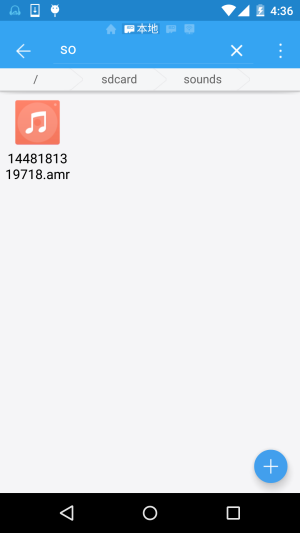

## 9.4 使用MediaRecord录音

### 

## 本节引言

本节是Android多媒体基本API调用的最后一节，带来的是MediaRecord的简单使用， 用法非常简单，我们写个例子来熟悉熟悉~

------

## 1.使用MediaRecord录制音频

**运行结果**：



**实现代码**：

布局代码：**activity_main.xml**：

```
<RelativeLayout xmlns:android="http://schemas.android.com/apk/res/android"
    xmlns:tools="http://schemas.android.com/tools"
    android:layout_width="match_parent"
    android:layout_height="match_parent"
    tools:context=".MainActivity">

    <Button
        android:id="@+id/btn_control"
        android:layout_width="wrap_content"
        android:layout_height="wrap_content"
        android:text="开始录音" />

</RelativeLayout>
```

**MainActivity.java**：

```
public class MainActivity extends AppCompatActivity {

    private Button btn_control;
    private boolean isStart = false;
    private MediaRecorder mr = null;
    
    @Override
    protected void onCreate(Bundle savedInstanceState) {
        super.onCreate(savedInstanceState);
        setContentView(R.layout.activity_main);
        btn_control = (Button) findViewById(R.id.btn_control);
        btn_control.setOnClickListener(new View.OnClickListener() {
            @Override
            public void onClick(View v) {
                if(!isStart){
                    startRecord();
                    btn_control.setText("停止录制");
                    isStart = true;
                }else{
                    stopRecord();
                    btn_control.setText("开始录制");
                    isStart = false;
                }
            }
        });
    }


    //开始录制
    private void startRecord(){
        if(mr == null){
            File dir = new File(Environment.getExternalStorageDirectory(),"sounds");
            if(!dir.exists()){
                dir.mkdirs();
            }
            File soundFile = new File(dir,System.currentTimeMillis()+".amr");
            if(!soundFile.exists()){
                try {
                    soundFile.createNewFile();
                } catch (IOException e) {
                    e.printStackTrace();
                }

            }
            mr = new MediaRecorder();
            mr.setAudioSource(MediaRecorder.AudioSource.MIC);        //音频输入源
            mr.setOutputFormat(MediaRecorder.OutputFormat.AMR_WB);   //设置输出格式
            mr.setAudioEncoder(MediaRecorder.AudioEncoder.AMR_WB);   //设置编码格式
            mr.setOutputFile(soundFile.getAbsolutePath());
            try {
                mr.prepare();
                mr.start();  //开始录制
            } catch (IOException e) {
                e.printStackTrace();
            }

        }
    }

    //停止录制，资源释放
    private void stopRecord(){
        if(mr != null){
            mr.stop();
            mr.release();
            mr = null;
        }
    }
}
```

最后别忘了在AndroidManifest.xml中添加下述权限：

```
<uses-permission android:name="android.permission.WRITE_EXTERNAL_STORAGE"/>
<uses-permission android:name="android.permission.RECORD_AUDIO"/>
```

好的，就是这么简单~

------

## 2.本节示例代码下载

[RecordDemo.zip](http://static.runoob.com/download/RecordDemo.zip)

------

## 本节小结：

> 好的，本节内容非常简单，就是MediaRecorder的使用而已，大概是整套教程中最精简的一节 了吧~嘿嘿~